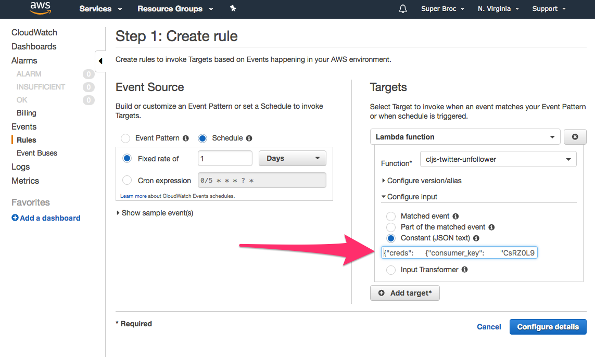

# Louie Bot

Oh yeah! This is the first incarnation of the Twitter auto-liker bot.

The aws handler begins in `index.js`. The main liking logic using the 'twit' library is in `louie-liker.js`, and `louie-bot.js` allows you to run the auto-liker locally.
 
When running this function via aws lambda, make sure to pass in a `creds` object that looks something like this:
 
